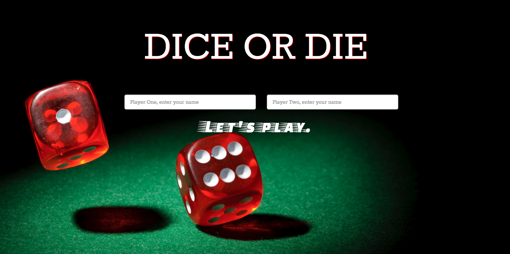

# _Pig Dice_

### _A two player game of chance, August 25, 2016_

#### _**By Aimen Khakwani & Ayana Powell**_

## Rules

* Each turn, a player repeatedly rolls a die until either a 1 is rolled or the player decides to "hold":
* If the player rolls a 1, they score nothing and it becomes the next player's turn.
* If the player rolls any other number, it is added to their turn total and the player's turn continues.
* If a player chooses to "hold", their turn total is added to their score, and it becomes the next player's turn.
* The first player to score 100 or more points wins.

####

##Setup and Installation

* _Clone from GitHub_
* _Run in browser_

## Technologies Used

_HTML, CSS, Bootstrap, jQuery, and JavaScript_

### License
Copyright (c) 2016 **_Aimen Khakwani & Ayana Powell_**
